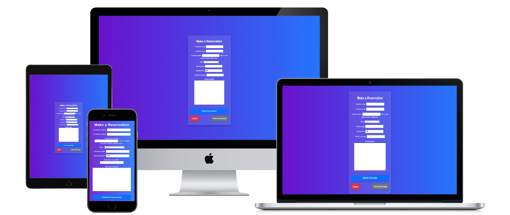
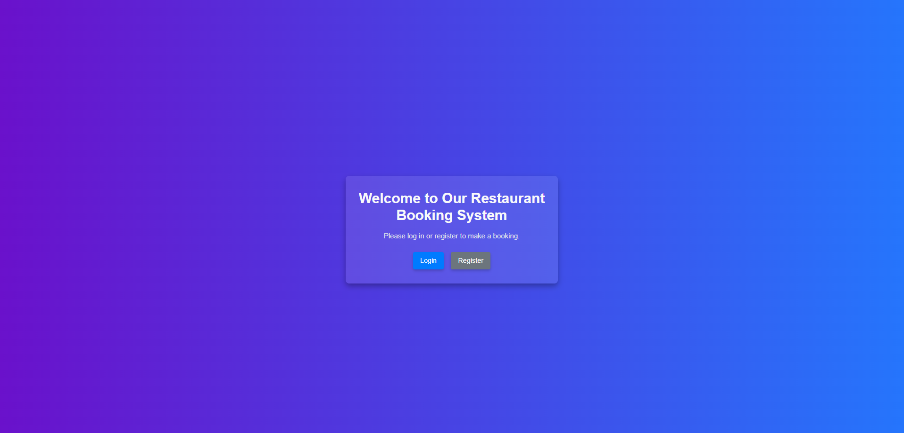
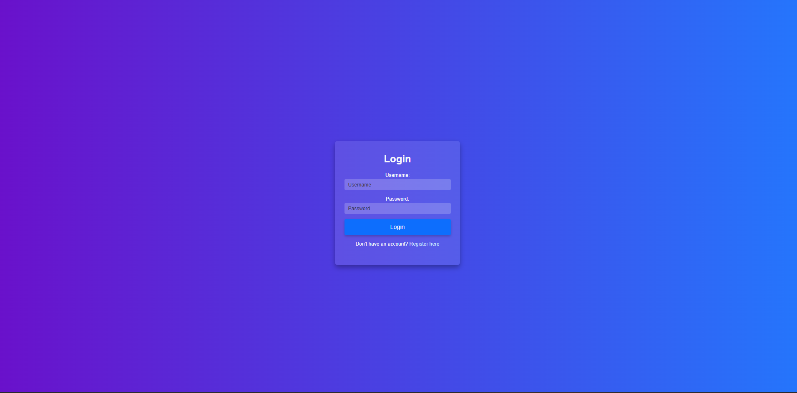
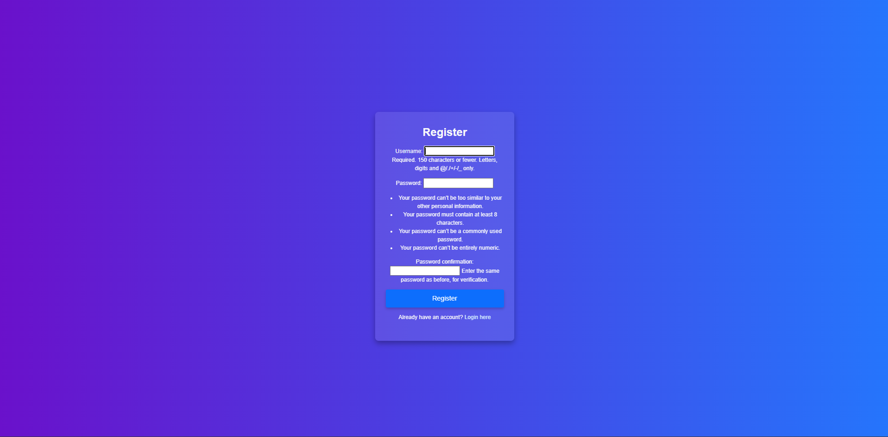
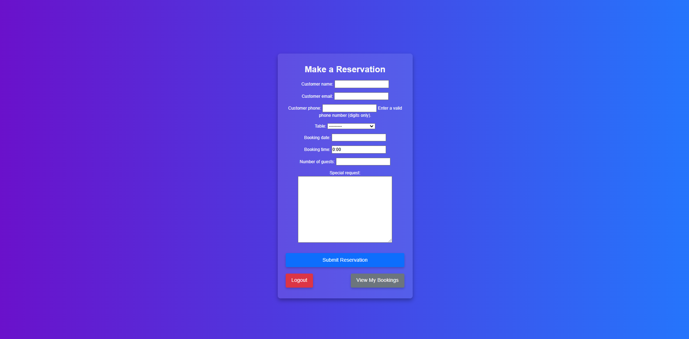
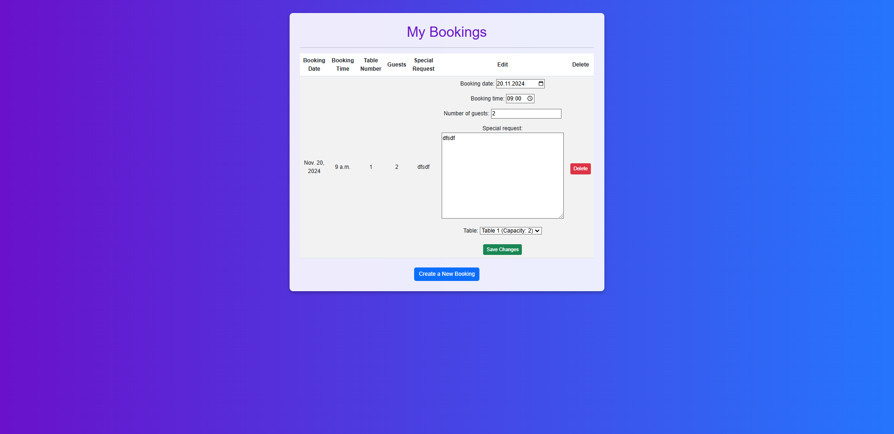
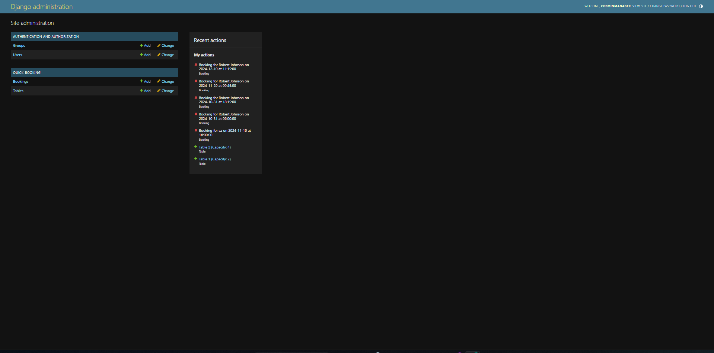

# Quick Booking

Experience seamless dining with our restaurant’s exclusive booking app! Designed specifically for our restaurant, the app makes it easy to reserve your table. With a user-friendly interface and instant confirmation, booking your next meal is just a few taps away. Enjoy a personalized dining experience tailored to your preferences—all in one place.

## Features

This app is designed specifically to elevate your dining experience at our restaurant, making reservations straightforward and personal. With its easy-to-use booking form, flexible options, and thoughtful validations, the app ensures that your experience—from booking to dining—is smooth and enjoyable.

### Key Features

- _Table Selection by Capacity_

    - Choose the table that best fits your party size. Each table has a defined capacity, helping you find the perfect fit for your group.

- _Flexible Booking with Date and Time Selection_

    - Reserve a table by selecting the specific date and time. The app ensures that bookings are made only within operational hours (9:00 AM - 10:00 PM) and prevents double-booking, guaranteeing your reservation is secure.

- _Guest Management_

    - Enter the number of guests for each reservation. The app automatically verifies that your chosen table can accommodate your party size

- _Special Requests_

    - Add any special requests or comments when booking, whether it’s dietary needs, celebration details, or seating preferences, so the restaurant can prepare to make your experience memorable.

- _Real-Time Validation_

    - The app checks that reservations are in the future, eliminating the risk of accidental past bookings. Real-time validation also applies to guest limits per table and phone number formatting.

- _User Account Integration_

    Manage your bookings directly with your user account. View and modify bookings easily, making adjustments if needed.

- _Reservation History_

    - Review your past reservations and stay organized with automatically timestamped booking details.

### How does the app work ?

- _First, you need to log in or register._

- _After you choose one of those options you will be redirected to one of this forms

 

- _After you log in or register you will be redirected to the booking form

- _After you make a booking you can always modify it on the "My Bookings" page

- _There also is an admin panael where you as restarurant administrator can modify bookings, tables and users_

## Testing

### Validator Testing